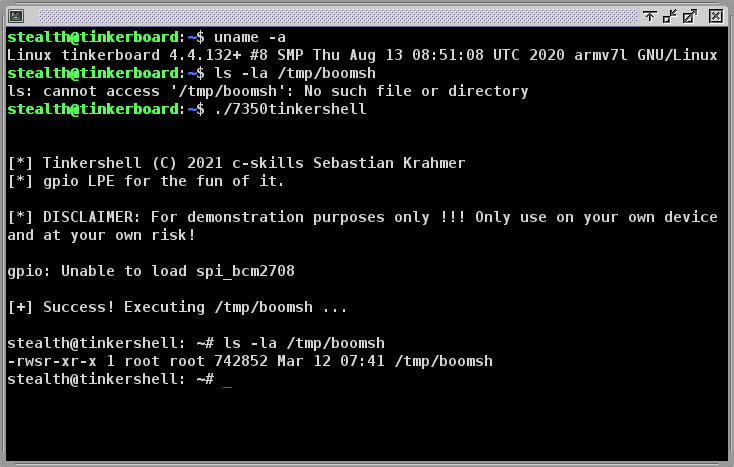

tinkershell
===========

This is a LPE PoC for the *Tinkerboard*, an IoT board running an embedded
Linux distro. Its for research and educational purposes only. Only run
it on your own devices and at your own risk.

I am currently researching IoT and embedded Linux platforms. The
*Tinkerboard* is a cool device and its fun playing with it.


Call for solidarity
-------------------

Please also check the post of [our friends at THC](https://github.com/hackerschoice/CVE-2021-26855) about censorship of PoC's!


Vulnerability
-------------

The *Tinkerboard* usually runs a Debian like embedded distro called *TinkerOS*
The vulnerability is within the `gpio` binary, which is a suid root binary at
the standard installation:

```C
 235 static void doLoad (int argc, char *argv [])
 236 {
 237   char *module1, *module2 ;
 238   char cmd [80] ;
 239   char *file1, *file2 ;
 240   char args1 [32], args2 [32] ;
 241
 242   checkDevTree (argv) ;
 243
 244   if (argc < 3)
 245     _doLoadUsage (argv) ;
 246
 247   args1 [0] = args2 [0] = 0 ;
 248
 249   /**/ if (strcasecmp (argv [2], "spi") == 0)
 250   {
 251     module1 = "spidev" ;
 252     module2 = "spi_bcm2708" ;
 253     file1  = "/dev/spidev0.0" ;
 254     file2  = "/dev/spidev0.1" ;
 255     if (argc == 4)
 256     {
 257       fprintf (stderr, "%s: Unable to set the buffer size now. Load aborted. Please see the man page.\n", argv [0]) ;
 258       exit (1) ;
 259     }
 260     else if (argc > 4)
 261       _doLoadUsage (argv) ;
 262   }
 263   else if (strcasecmp (argv [2], "i2c") == 0)
 264   {
 265     module1 = "i2c_dev" ;
 266     module2 = "i2c_bcm2708" ;
 267     file1  = "/dev/i2c-0" ;
 268     file2  = "/dev/i2c-1" ;
 269     if (argc == 4)
 270       sprintf (args2, " baudrate=%d", atoi (argv [3]) * 1000) ;
 271     else if (argc > 4)
 272       _doLoadUsage (argv) ;
 273   }
 274   else
 275     _doLoadUsage (argv) ;
 276
 277   if (findExecutable ("modprobe") == NULL)
 278     printf ("No found\n") ;
 279
 280   if (!moduleLoaded (module1))
 281   {
 282     sprintf (cmd, "%s %s%s", findExecutable (MODPROBE), module1, args1) ;
 283     system (cmd) ;
 284   }
 285
 286   if (!moduleLoaded (module2))
 287   {
 288     sprintf (cmd, "%s %s%s", findExecutable (MODPROBE), module2, args2) ;
 289     system (cmd) ;
 290   }
 [...]
```

The call to `system()` can be triggered by any user, who in turn would pass apropriate
`MODPROBE_OPTIONS` environment variable to the modprobe invocation, executing arbitrary
commands as root.


Demo run
--------

This demo runs on (as of today latest) *TinkerOS V2.1.16* with latest updates installed.




